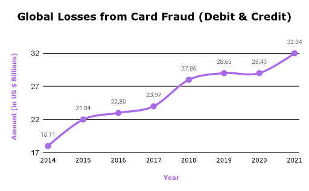
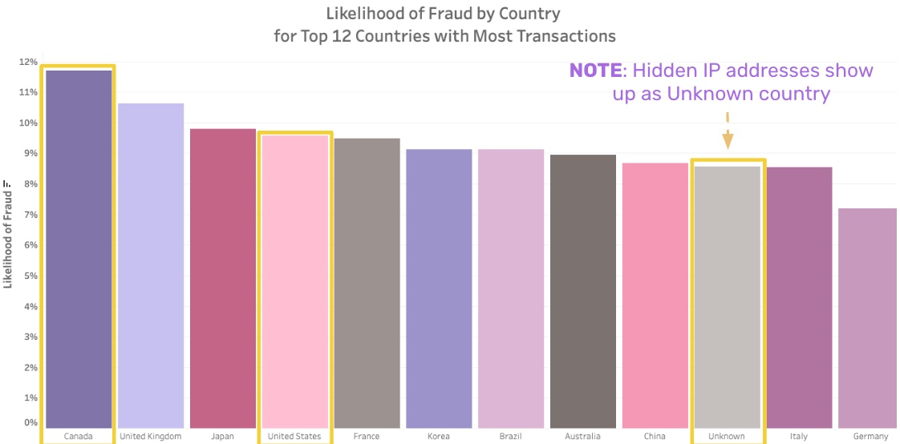

# Quick and Same-Device E-Commerce Card Transactions are More Likely to be Fraudulent 

#### Author: Lillian Lakes
- [GitHub Profile](https://github.com/lillianlakes) 
- [LinkedIn Profile](https://www.linkedin.com/in/lillianlakes/)

## For More Information
To explore my findings further, please review the full analysis in the [Jupyter Notebook](index.ipynb) or view my [Presentation Slide Deck](presentation.pdf) and [Live Presentation Recording](https://www.youtube.com/watch?v=0o_FqgBbkAQ). 

## Business Problem

Card fraud is on the rise. In December 2022, the Nilson Report stated that it expects global losses from card fraud to total [$397.4 billion over the next 10 years](https://www.bankrate.com/finance/credit-cards/credit-card-fraud-statistics/#types), with $165.1 billion of those losses happening in the United States. Global trends between 2014 and 2021 support this alarming forecast [(Card Fraud Worldwide)](https://www.bankrate.com/finance/credit-cards/credit-card-fraud-statistics).

Furthermore, in 2021, the Federal Trade Commission (FTC) fielded [nearly 390,000 reports of credit card fraud](https://www.ftc.gov/system/files/ftc_gov/pdf/CSN%20Annual%20Data%20Book%202021%20Final%20PDF.pdf). In the same year, credit card fraud ranked as the [second most common type of identity theft in the U.S.](https://www.ftc.gov/system/files/ftc_gov/pdf/CSN%20Annual%20Data%20Book%202021%20Final%20PDF.pdf), behind fraud involving government benefits or documents, according to the FTC. 

Almost every consumer is affected. A [survey by Symantec](https://www.cnbc.com/2016/06/28/most-people-unaware-of-the-risks-of-using-public-wi-fi.html) found that 87% of U.S. consumers use public WiFi for online shopping. Financial institutions have important decisions to make when it comes to managing risks while keeping consumers happy.

In this project, I analyze over 150,000 e-commerce transactions using cards and present recommendations to help financial institutions accurately detect card fraud and minimize the cost of both false positive and false negative detection. Financial institutions care most about accuracy as a metric because it minimizes both false positives and false negatives. When transactions by good users are incorrectly flagged, these customers get aggravated and may churn, leading to lost revenue for financial institutions. On the other hand, when fraudulent transactions are not properly flagged, financial institutions experience losses and are obligated to rectify the fallout from identity theft. 

Identifying variables that lead to fraud prevents both lost revenue and increased costs to financial institutions.

## Data Overview

The raw data comprises two datasets from [Kaggle](https://www.kaggle.com/vbinh002/fraud-ecommerce) provided by [Binh Vu](https://www.kaggle.com/vbinh002).

The fraud dataset includes 151,112 entries and 11 variables, including signup time, purchase time, purchase value, device id, user id, browser, IP address, source, sex, age, and fraud classification.

The IP table dataset includes 138,846 entries and 3 variables, including IP address upper and lower bounds, and country. I used this dataset to map the IP addresses in the fraud dataset to an origin country.

## Data Limitations

- **Real vs Synthetic Datasets and Data Transparency** - A major limitation for the validation of existing fraud detection methods is the lack of public datasets. Publicly available real datasets are largely anonymized for consumer data privacy concerns, company proprietary information security measures, and only voluntary participation in the USA Patriot Act (through which banks can legally share customer data for the purpose of identifying money laundering activity and fraud). One of the few examples is the [Credit Card Fraud Detection dataset](https://www.kaggle.com/datasets/mlg-ulb/creditcardfraud) made available by the [ULB Machine Learning Group](https://mlg.ulb.ac.be/wordpress/). This contains anonymized credit card transactions labeled as fraudulent or genuine. In this dataset, there are 28 anonymized features, V1 to V28, that are a result of a PCA (Principal Component Analysis) Dimensionality reduction to protect user identities and sensitive features. By reducing the dimensionality of large data sets (i.e. transforming a large set of variables into a smaller one that still contains most of the information in the large set), PCA limits fraud detection analysis. Therefore, fraud detection analysis of publicly available datasets with transparent features is mostly limited to synthetic data.

- **Additional Features** - It would have been nice to have additional features describing good and fraudulent customer behavior, such as:

  1. Card Type - Credit and debit cards have different inherent risks and security features. For instance, credit cards use CVV (Card Verification Value) codes while debit cards use PINs.

  2. Product SKU - Some products may be more likely to be purchased fraudulently than others.

  3. Data relating to how the customers connect to the site (e.g. VPN, proxy, or Tor usage) since scammers go to great lengths to be undetectable.

  4. Type of Device - Although the dataset includes device ID, I do not know what type of device was used. There may be patterns in the type of devices that scammers use.

  5. Data on Whether Transaction Passed Additional Checks - Transactions that do not pass checks, such as CVV (Card Verification Value) and AVS (Address Verification System), are more likely to be fraudulent. Yet, I have no information on whether checks were passed.
  
  6. IP Addresses in Standard Format - Although available, the IP addresses provided are not a standard form that would make validation on real datasets easier.

- **Class Imbalance**: The dataset has a disproportionately low ratio of observations in the fraudulent classification category, at only 9.36%. Class imbalance can be addressed using resampling techniques (Oversample Minority Class or Undersample Majority Class) or generating synthetic samples. In this project, I address the imbalance using SMOTE (Synthetic Minority Oversampling Technique).

## Methods

This project uses feature engineering, Exploratory Data Analysis (EDA), and models to support my recommendations. I explored ten different models, and selected two that had the best performance and interpretability. 

Prior to visualizing and modeling the data, I performed feature engineering. For example, I mapped IP addresses to countries using the IP table and created variables for 'relevant countries' that were heavily represented in the dataset. For transactions with hidden IP addresses, country was mapped to 'Unknown'. From countries, I also created a variable for the number of countries associated with the device's transactions.

Using the signup and purchase times, I created variables for purchase month, weekday, and period of day. I used the signup and purchase times to create a ‘seconds since signup’ variable, that I further engineered into a Quick Purchase variable indicating whether or not a purchase was made within 137 seconds of signup.

Additionally, I used Device ID to create a 'device frequency' value indicating the number of times a device was used in the dataset.

To figure out what predictors might be more likely to result in a fraud transaction classification, I created a few visuals. 

The below chart shows the likelihood of fraud by purchase month. **I found that January, following the holiday shopping rush, has the highest likelihood of fraud**.

Next, I looked at the likelihood of fraud by whether or not a purchase was made within 137 seconds of signup. **In the data, purchases made less than 137 seconds after signup are all fraudulent**.

I also looked at the likelihood of fraud by number of purchases made from the same device. **I found that fraud is more likely to occur when purchases are made from the same device**.

I also analyzed countries, beginning with the top 12 countries with the most transactions. **IP addresses from the United States are most represented, followed by IP addresses that are not trackable**.

I delved deeper into the analysis of countries by looking at the likelihood of fraud by country for the top 12 countries with the most transactions. **Of the top 12, Canada has the most fraudulent transactions, and the United States has high fraud levels**.

I dug even further into the country analysis by using a map to explore the number of transactions, amount of fraud, and breakdown of quick purchases by country. **The United States has the most transactions, overall and fraudulent, with a high proportion of quick purchases**.

To explore these visuals further, please view [this project's Tableau dashboard](https://public.tableau.com/views/CardFraudDetectionforE-CommerceTransactions/Dashboard1?:language=en-US&publish=yes&:display_count=n&:origin=viz_share_link).

Next, I explored several models to analyze the e-commerce transactions and identify high predictors of fraud. The performance and interpretability of these models is summarized in the table below.

More details, such as the confusion matrices, Area Under the Curve - Receiver Operating Characteristic (AUC-ROC) Curves, and Area Under the Curve - Precision-Recall (AUC-PR) Curves can be found in the [Jupyter Notebook](index.ipynb) and appendix section of the [Presentation Slide Deck](presentation.pdf).  

## Results

The Logistic Regression models (base model [Model 3] and with lasso regularization [Model 4]) both performed well and are easy to interpret. Both models had good accuracy, AUC and AUC-PR scores. These scores for the logistic regression model were 92.0%, 81.8% and 71% respectively. For the logistic regression with lasso regularization, these scores were 91.6%, 82.2% and 70% respectively. 

I got straightforward quantifiable insights from the odds ratios of the models. The logistic regression model suggests that purchases made within the first 137 seconds of signup are 110 times more likely to be fraudulent. It also shows that a device used one additional time is 8 times more likely to make a fraudulent purchase. The logistic regression model with lasso regularization suggests that purchases made within the first 137 seconds of signup are 39 times more likely to be fraudulent. It also shows that a device used one additional time is 29 times more likely to make a fraudulent purchase.

## Recommendations
Given these results, I would recommend that financial institutions adopt a fraud probability scoring model to evaluate e-commerce transactions. This model should heavily weigh quick purchases and device frequency, along with other predictors that are most relevant to each institution (for instance, purchase value). The fraud risk of each transaction could be gauged from the scoring model, such that transactions with low probability scores proceed with no interruptions, transactions with medium probability scores would need to pass two-factor authentication before proceeding, and transactions with high probability scores would need to be approved via a call to the financial institution's fraud prevention line.

Given the findings from the exploratory data analysis, I also recommend that financial institutions staff their customer service and fraud prevention departments higher in the month of January, when fraud risk is higher following the holiday shopping period.

### Future Steps

Future areas for analysis that could build on the findings from this project include:

- Time-Series analysis to spot fraud trends over time: Given the trends from the Card Fraud Worldwide graph, and the figures from the Nilson Report, it is evident that card fraud is on the rise. It would be interesting to see if the trends over time within this project's dataset also show that card fraud is on the rise.

- Finding publicly available real datasets with mostly transparent data 

- Detecting other forms of identity theft, such as government benefits and documents, the second most common form

## Repository Contents

    .
    ├── data                          # Directory containing original data files and cleaned master data CSV
    │   │
    │   ├── Fraud_Data.csv 
    │   ├── Fraud_Data_after_Feature_Eng.csv 
    │   ├── IpAddress_to_Country.csv
    │   └── fraud_detection.zip
    │    
    ├── images                        # Directory containing files used in final Jupyter Notebook and
    │   │                             # README.md files
    │   ├── GH_Header.jpg
    │   ├── countries_transactions_quick_purchases.jpg
    │   ├── countries_with_most_transactions.jpg
    │   ├── credit_card_declined.jpeg
    │   ├── credit_card_scammer1.jpeg
    │   ├── credit_card_scammer2.jpeg
    │   ├── fraud_by_country.jpg
    │   ├── fraud_by_device_frequency.jpg
    │   ├── fraud_by_purchase_month.jpg
    │   ├── fraud_by_quick_purchase.jpg
    │   ├── global_losses_2014_2021.png
    │   └── model_summary_table.jpg  
    │    
    ├── .gitignore                    # Text document listing directories and files to ignore
    ├── README.md                     # This document
    ├── index.ipynb                   # Final narrative notebook of data analysis 
    └── presentation.pdf              # PDF version of presentation slides
